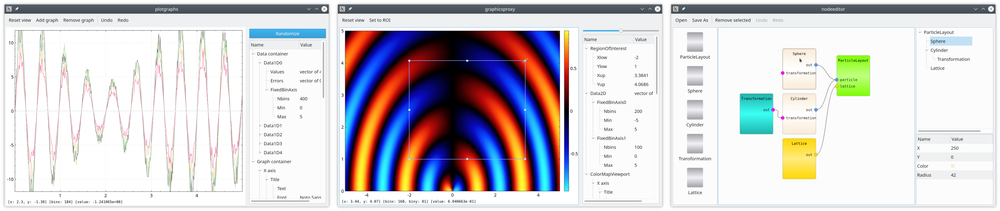
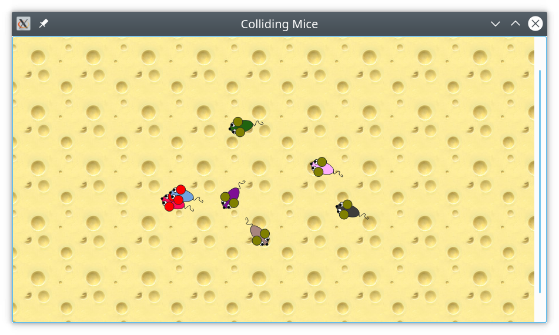
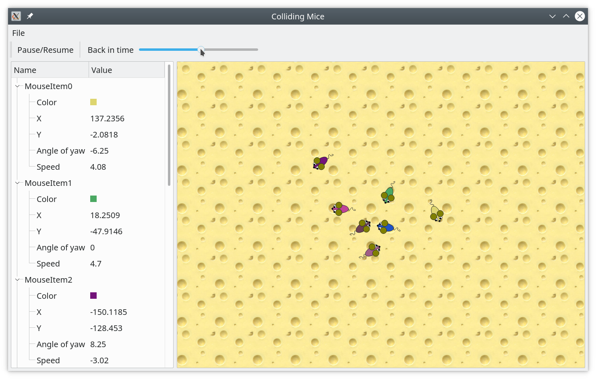
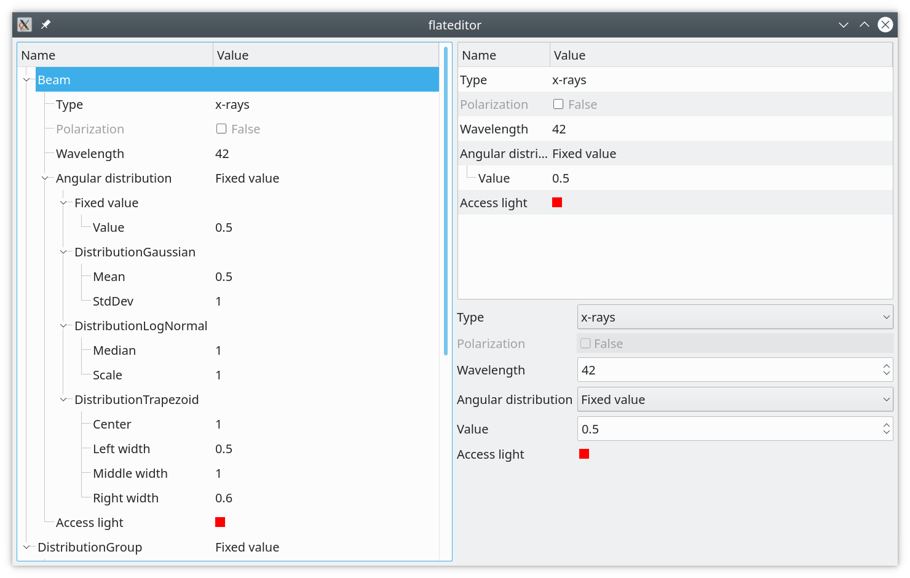

# Model View ViewModel framework for large C++ Qt applications

[](https://github.com/gpospelov/qt-mvvm/actions?query=workflow%3ALinux)
[](https://github.com/gpospelov/qt-mvvm/actions?query=workflow%3AWindows)
[](https://github.com/gpospelov/qt-mvvm/actions?query=workflow%3AMacOS)


[](https://codecov.io/gh/gpospelov/qt-mvvm)

## Overview

This model-view-viewmodel framework is intended for large Qt based scientific
applications written in C++. Project was created as a playground toward GUI
refactoring of [BornAgain project](https://www.bornagainproject.org).

Main features of the framework are:

+ Application model to store arbitrary data of GUI session.
+ Serialization of application models to json.
+ Undo/redo based on command pattern.
+ View model to show parts of application model in Qt widgets. Depends on Qt.
+ Scientific plotting based on [qcustomplot](https://www.qcustomplot.com/).
+ Automatic generation of widgets from model content.
+ Property editors.
+ Flexible layout of Qt's trees and tables.

[](examples/README.md)

## Requirements

+ C++-17
+ CMake 3.14
+ Qt 5.12

## Installation instructions

```
git clone --recurse-submodules  https://github.com/gpospelov/qt-mvvm.git
mkdir <build-dir>; cd <build-dir>
cmake <source>; make -j8; ctest

# run one of examples
<build-dir>/bin/collidingmice
```

## Example

If you are familiar with Qt's reach example section you might saw
it's funny `collidingmice` example showing basics of
`QGraphicsScene`.



To demonstrate the idea behind `qt-mvvm` library the code of the example was
slightly modified. The mice data has been moved into the dedicated model, the
content of the model was shown both in the `QGraphicsScene` and in `QTreeView`.
It is possible now to save the application state in json file and later load the
session back with saved mice positions. Additionally, it is possible to go back
in time and watch how mice are moving in opposite directions by dragging a
slider:



See short animation [here](doc/assets/colliding-mice.gif).

The demo shows that `qt-mvvm` library allows to equip the GUI with the
serialization and undo/redo and to provide proper model/view relations via
relatively small modifications to the original code. Implementing similar
features from the scratch in bare metal Qt would take much more time and the
resulting code wouldn't be easily transferable to another project.

This and other examples can be found in [examples](examples/README.md)
sub-directory of qt-mvvm package.

## The context

Qt, naturally, has [model
view](https://doc.qt.io/qt-5/model-view-programming.html) to manage the data and
its presentation. According to some, [Qt is misusing the model view
terminology](https://stackoverflow.com/questions/5543198/why-qt-is-misusing-model-view-terminology)
and more correct naming would be

+ Data -> Model
+ Model -> ViewModel
+ Delegate -> Controller
+ View (that's ok)

Whatever the right terminology is, Qt doesn't tell much about the architecture
of complex applications, how to structure the `Data` and where to put business
logic. Qt's [model view](https://doc.qt.io/qt-5/model-view-programming.html) is
rather a way to adapt the user data for Qt's trees and tables and adjust their
behavior with delegates.

Given library is an attempt to understand how to deal with the application data.

## More explanations

The framework consists of three libraries: `libmvvm_model.so`,
`libmvvm_viewmodel.so`, and `libmvvm_view.so`.

`libmvvm_model.so` defines tree-like structure `SessionModel` to store any data
of the GUI session. This part of the framework is intentionally made
Qt-independent. The idea behind is the following:

In large Qt applications, the business logic gets quickly spoiled with
presentation logic. Qt classes like `QModelIndex` start to appear everywhere,
even in places that have nothing to do with Qt graphics. Attempt to store GUI
session data in `QAbstractItemModel` leads to inflexible layout in Qt trees and
tables. Attempt to fix this with `QAbstractProxyModel` leads to the appearance
of overwhelmingly complicated proxy models. Removing Qt from dependencies allows
focusing more on common needs (i.e. objects construction, property editing, etc)
of GUI applications rather than on presentation details.

`SessionModel` has a concept of properties, undo/redo, serialization, and it's
own minimal signaling to handle business logic. Thus, the intention here is to
build an application model to handle data and logic of GUI  while being
independent on any particular GUI library.

> Strictly speaking, `libmvvm_model.so` still relies on `QVariant` but
> eventually, it will be replaced with std::variant.

Second library, `libmmv_viewmodel.so`, contains `ViewModel` and serves as a thin
counterpart of `SessionModel` in the Qt world. `ViewModel` doesn't own the data
but simply acts as a `proxy` to different parts of `SessionModel`. It is derived
from `QAbstractItemModel` and intended to work together with Qt's trees and
tables. The layout of `ViewModel` (i.e. parent/child relationships) doesn't
follow the layout of the original SessionModel. It is generated on the fly by
using strategy `who-is-my-next-child` provided by the user. In practice, it
allows generating Qt tables and trees with arbitrary layouts, based on a common
data source, without diving into the nightmare of `QAbstractProxyModel`.
Particularly, the aforementioned machinery allows having something in the line
of the ancient [Qt property browser
framework](https://doc.qt.io/archives/qq/qq18-propertybrowser.html). 

[](examples/README.md)


Third library, `libmmv_view.so`, contains few widgets for plotting and property
editing.

## Size of the framework

+ 20k loc of libraries (`libmvvm_model.so`, `libmmv_viewmodel.so` and `libmmv_view.so`)
+ 15k loc of tests
+ 10k of user examples

## Disclaimer and afterword

The library is intended for large GUI applications. The definition of `large` is
quite arbitrary and means something in the range 20k - 200k lines of code. The
main logic here is that using the additional library for smaller Qt applications
is redundant, Qt has everything that may be required. If small GUI becomes messy
with time, it can always be refactored or even rewritten from scratch.

However, when the number of views to show the same data is getting large, and
the GUI enters the range 20k - 200k, this is were a given library might help in
proper separation of data, logic, and UI. When the GUI grows even further, well,
developers of such large GUI know already what they need and probably have
already implemented similar machinery.

The project is under active development.


