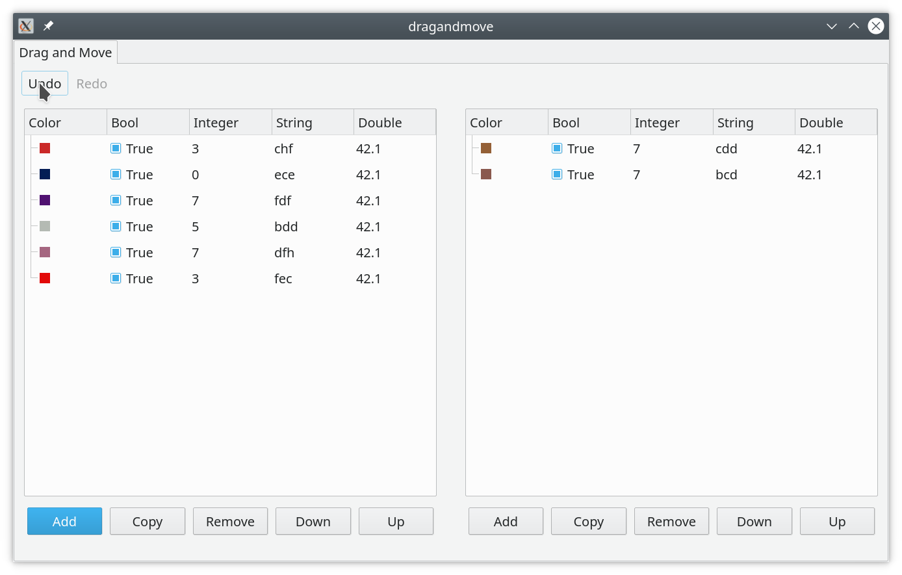
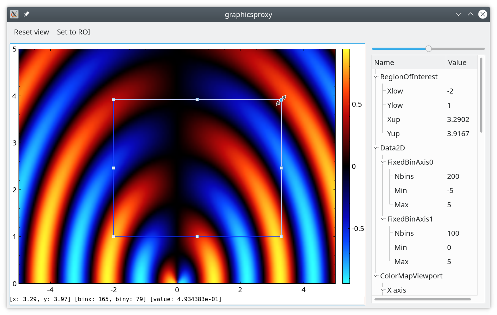
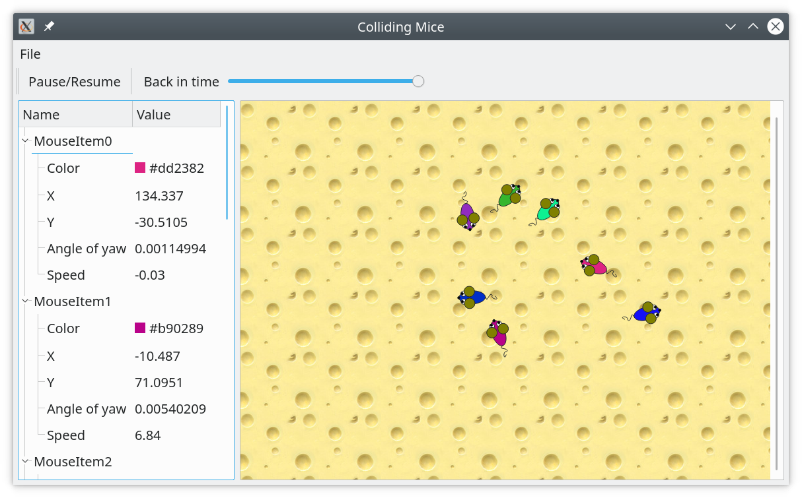

# Collection of examples demonstrating the usage of Qt mvvm framework.

### [`Hello Word!` example of `qt-mvvm` library.](helloworld/README.md)

### [Treeviews: how to represent the model using trees with different layouts.](treeviews/README.md)

### [Celleditors:  how to create editable properties and use various editors in cells of Qt trees and tables.](celleditors/README.md)

### [Plotgraphs:  how to plot one-dimensional graphs.](plotgraphs/README.md)

### [Plotcolormap:  how to plot two-dimensional heat maps.](plotcolormap/README.md)

### [Dragandmove:  how to copy and move items between two tables and use undo-redo.](dragandmove/README.md)

### [Flateditor: how to automatically populate grid layout from  application model content.](flateditor/README.md)

### [Layereditor: how to creates custom tree layout and how to serialize application data.](layereditor/README.md)

### [Graphicsproxy: how to embed QCustomPlot to QGraphicsScene to plot complex things on top.](graphicsproxy/README.md)

### [Collidingmice: how to modify third-party application to provide serialization, undo-redo and proper model-view relations.](collidingmice/README.md)

### [Concurrentplot: how to run heavy simulations in the background and regularly update plots.](concurrentplot/README.md)

### [Saveloadproject: how to save project on disk and how to handle all this typical save/save-as/new and select-recent logic.](saveloadproject/README.md)

### Under development

+ helloworld
+ modelinqml

