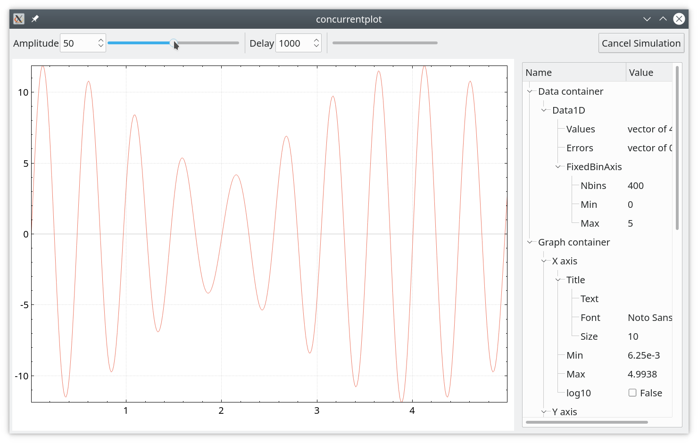

# Example "concurrentplot".

Running heavy simulations in a separate thread and plotting from the main
thread.

Toy simulation is triggered every time the user changes `Amplitude` using a
slider or corresponding spinbox. The duration of the simulation (i.e. CPU
"heaviness") is imitated by using the `Delay` parameter. When the simulation is
completed, the graph points are updated. Simulation is running in a separate
thread to keep all UI elements responsive.

If a simulation is slow and the user moves slider fast, then the job manager
will drop the previous queued slider value. The idea is to be able to simulate
at least some requests of the user and so provide at least some feeling of
smoothness.

If the simulation is very fast with respect to the plotting, then similarly,
plotting will drop some of the simulation results.

