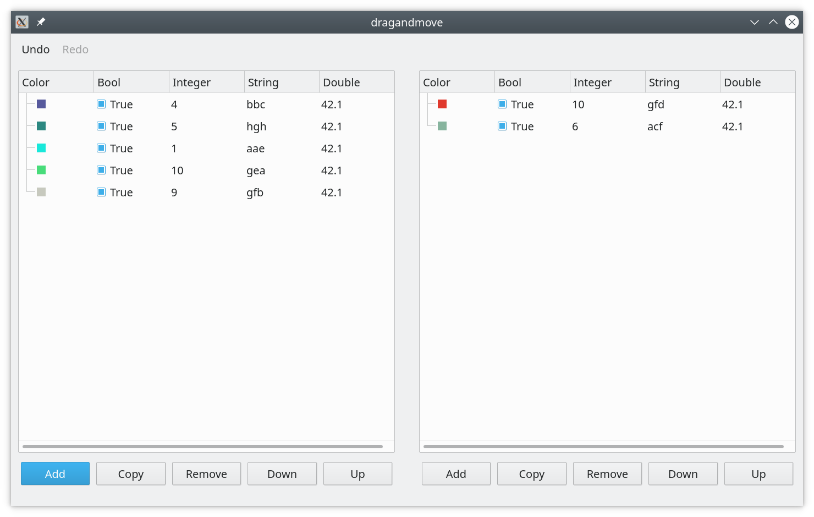

# Example "dragandmove".

The example shows how to copy and move items between two tables and use
undo-redo.

The application model contains two containers with a collection of items.
Containers are shown using two table views, where rows are maid of items, and
columns are made of item's properties. The user can move items to a different
table row, drag-and-move items between two tables and use undo to return to the
previous state.
