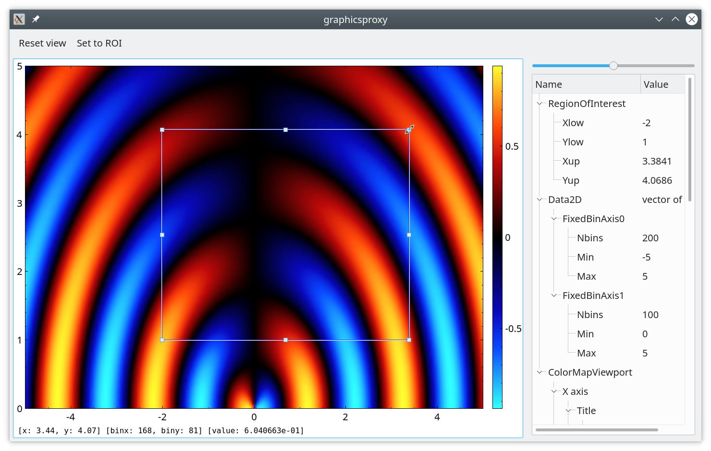

# Example "graphicsproxy".

The example shows how to embed `QCustomPlot` in the `QGraphicsScene` to plot
complex graphics on top of `QCustomPlot` and how to adapt coordinates of
`QCustomPlot` to the local coordinate system of `QGraphicsScene`.

Users can adjust the size of the region-of-interest rectangle and click on `Set
toROI` button to make viewport axes range matching the rectangle.

Region of interest coordinates, as well as axes range and zoom level, are displayed in the `QTreeView` on the right. Values changed through the tree are propagated back to the plot.

## Application data

Application model contains four items.

+ `RegionOfInterestItem` contains coordinates of the `roi` rectangle.
+ `Data2DItem` contains 2D histogram to show (data points and data axes definition).
+ `ColorMapItem` contains link to `Data2DItem` and additional presentation properties (i.e. gradient).
+ `ColorMapViewport` defines viewport axes, color bar on the right and is intended to show `ColorMapItem`.

## Other classes

+ `RegionOfInterestView` represents `RegionOfInterestItem` on `QGraphicsScene`.
+ `RegionOfInterestController` establishes communication between item and view.
