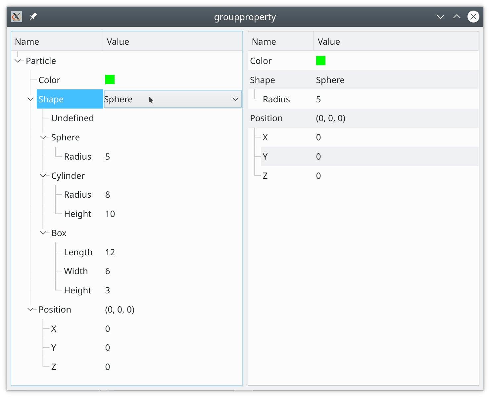

# Example "groupproperty".

Here we are explaining, what the group property is and how to use it.

Consider a parametrization of a nanoparticle for later simulation of x-ray scattering from it. Our nanoparticle has a color, `(x,y,z)` coordinates in space, and a shape.
 For a shape we want to provide the user with a choice: particle can be spherical, cylindrical, or represent a box. Each of the shapes has own set of parameters (`radius` for a sphere, `(length,width,height)` for a box, etc).

The group property allows defining a set of shapes and switch between them in a convenient manner. Our application model contains a single `ParticleItem` in it. It has 3 following properties:

- Color property.
- `ShapeGroupItem` property for a shape selection.
- `VectorItem` property for position.

The same `ParticleItem` is shown in two editors. The ordinary tree on the left represents the whole content of the model. The property editor on the right shows the content of `ParticleItem` where unused shapes and their parameters are hidden.

See short animation [here](../../doc/assets/groupproperty.gif).
