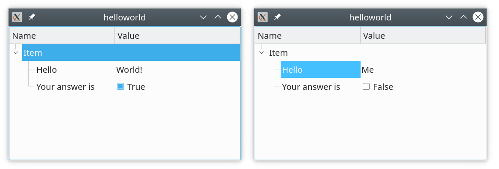

# `Hello Word!` example of `qt-mvvm` library.

This explains how to create a model, add property items to it, implement simple
business logic, and show the content of the model in Qt widgets by adapting it
for `QAbstractItemModel` interface.



In this example, the main window contains a tree view with a simple model in it.
The content of one cell is reacting to changes in another cell. This was
achieved in the following way:

First, `SessionModel` is created, single `CompountItem` is inserted to it.

```C++
SessionModel model;
auto item = model.insertItem<CompoundItem>();
item->setDisplayName("Item");
```

We add two property items to it. One property with the name `Hello` is intended
to store `std::string` with current value `World!`. The second property has a
name `Your answer is` and intended to store `bool` values, with current value
`true`.

```C++
item->addProperty("Hello", "World!");
item->addProperty("Your answer is", true);
```

Next, we create callback which will be triggered each time `item's` properties
are changing. In this particular case, we will update the value of the property
`Your answer is` depending on whether the value of the property with the name
`Hello` is equal to `World!`, or not.

```C++
auto on_property = [](SessionItem* item, const std::string& name) {
    if (name == "Hello")
        item->setProperty("Your answer is", item->property<std::string>("Hello") == "World!");
};
item->mapper()->setOnPropertyChange(on_property, nullptr);
```

Finally, we show the content of the model in `QTreeView`. We create
`DefaultViewModel` to adapt content of `SessionModel` to `QAbstractItemModel`
interface with one-to-one layout. And we create a delegate to get a fancy editor
for `bool` values.

```C++
DefaultViewModel viewmodel(&model);
ViewModelDelegate delegate;
```

Finally, let's initialize the tree with a view model and delegate.

```C++
QTreeView view;
view.setModel(&viewmodel);
view.setItemDelegate(&delegate);
view.show();
```
