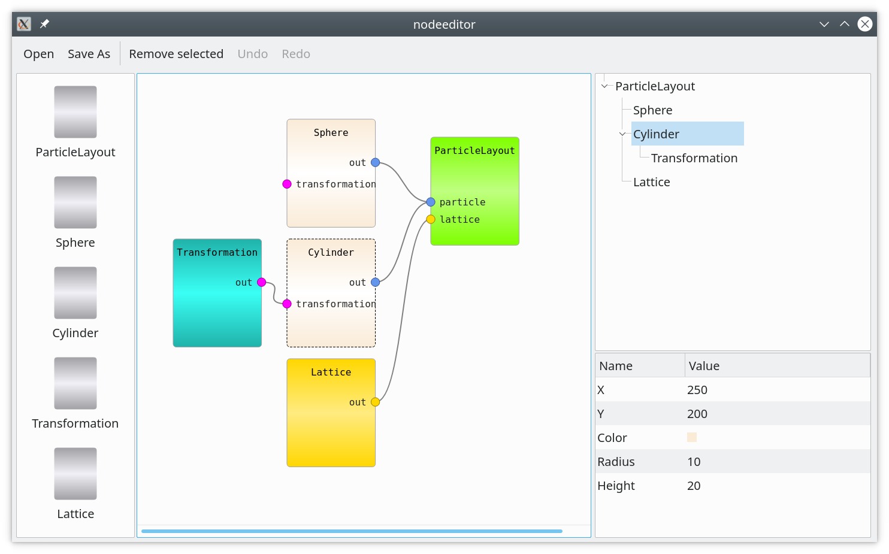
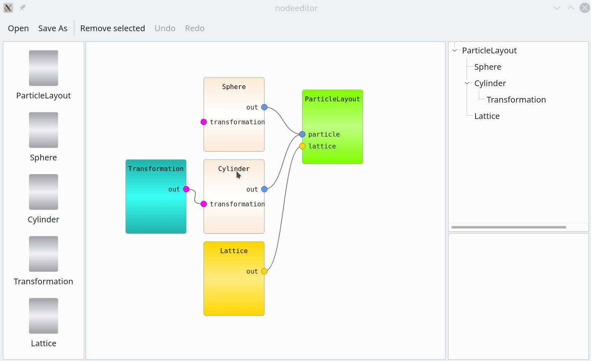

# Example "nodeeditor".

The example shows a node editor similar to those we can find in LabView,
Blender, Maya, and other applications. It allows organizing complex settings in
the form of a dependency graph, displaying nodes and the connections between
their attributes.

> Node editor: original code is taken from
> http://algoholic.eu/qnodeseditor-qt-nodesports-based-data-processing-flow-editor/
> Copyright (c) 2012, STANISLAW ADASZEWSKI.

The example from the link was adapted for `qt-mvvm` library. The resulting
application provides a data model, various view models (e.g. node editor,
property editor, hierarchy view), serialization, and undo/redo.

## The context.

In this particular example, the node editor is used to set up `ParticleLayout`
for further simulation of neutron scattering from some nano-particle arrangement.
The layout carries information about particles populating a crystal lattice.
The `ParticleLayout` can have an arbitrary amount of particles attached, but
only one single lattice. Particles can be rotated with the help of the
`Transformation` object. There can be many layouts on the scene.

## Widgets.

- The list view on the left. Items from the list can be drag-and-dropped on the scene.
- Node editor. Ports of the same color can be connected together.
- Tree view present same model as node editor in the form of object hierarchy.
- Property editor shows all properties of currently selected node.

## Details.

### `ConnectableItem, ConnectableView and ConnectableItemController`

The `ConnectableItem` is a base class for all items representing nodes. Doesn't
contain presentation-related details (color, shape parameters, etc). Serves as a building block for `SampleModel`. The
`ConnectableView` is a counterpart of `ConnectableItem` on the graphics scene.
The `ConnectableItemController` provides updates of the `ConnectableView`'s position/appearance on
the graphics scene when the underlying `ConnectableItem` changes. Similarly, it provides an update of
the item's properties while the view is moved on the scene by the user.

### `NodePort, NodeConnection and NodeController`

This is the part which came originally from [Node Editor by STANISLAW ADASZEWSKI](http://algoholic.eu/qnodeseditor-qt-nodesports-based-data-processing-flow-editor).
Contains machinery to establish elastic connections between ports.

### `GraphicsScene and GraphicsSceneController`

The `GraphicsSceneController` listens to the original `SampleModel` 
and updates the scene on model change. When an item is removed from the model, the corresponding view will be removed too. When an item is added to the model, 
a new view will be added to the scene.
When the elastic connection is established between two nodes, this triggers a parent change request to the `SampleModel`. 
This, in turn, leads to the update on the graphics scene. Views will be created and connected with elastic connections  
to represent new parent/child relationships in the underlying model.

