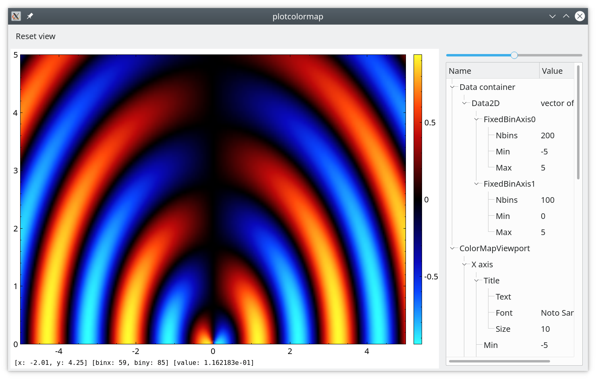

# Example "plotcolormap".

The example shows how to plot a two-dimensional intensity map as a colormap
using wrappers around `qcustomplot` library. 

The application model contains a collection of various items to properly
separate `scientific data` from `presentation data`. 

## Data2DItem

It's an item to hold buffer of `double` values, holding 2D data, and the
information about axis binning. `Data2DItem` is not intended for direct plotting
and needs `ColorMapItem` for that.

## ColorMapItem

It's an item that contains a link to certain `Data2DItem` and serves as a
wrapper around scientific data. Its main purpose is to carry the additional data
for presentation purposes: the title of the graph, the gradient of a heat map,
etc. `ColorMapItem` is not intended for direct plotting and needs
`ColorMapViewportItem` for that.

## ColorMapViewportItem

It's an item that can have an arbitrary amount of `ColorMapItem's` on board.
Additionally, it contains items to store the data related to viewport axes:
current zoom level, axis title, color bar data, etc. `ColorMapItem` needs
`ColorMapCanvas` for plotting.

## ColorMapCanvas

It is a widget, wrapper around `QCustomPlot`, provided with status string. It
shows the content of `ColorMapViewportItem` on the screen and establishes the
signaling between `QCustomPlot` and `SessionModel`. When the user zooms in into
`QCustomPlot` with the mouse wheel or drag color bar, the data of the model is
updated. Similarly, when data is updated in a model via some tree or table view,
the changes are propagated back to `qcustomplot`. If the user saves a project
file, all zoom levels and, possibly, other settings of `qcustomplot` can be
automatically preserved.

