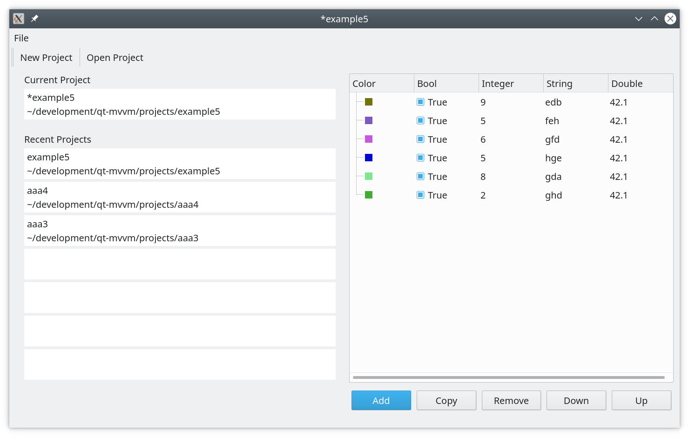

# Example "saveloadproject".

The example shows how to save/load projects on disk.
The project is a collection of `json` files representing application models in a folder on disk.

In this example, we demonstrate, how to handle usual activity related to the
creation of a new project or opening an existing one.
Standard scenarios are taken care of:

+ User starts an application, modifies the content, then decides to close it without saving.
+ User opens the project from the list of the existing ones.
+ User saves the project under a different name.
+ User tries to create a new project while having unsaved changes.

And many other similar combinations.
Application tracks the list of recent projects and last selected directory in `QSettings`.

## The big picture

The application can have an unlimited amount of models.
They can be saved either in a single `JSON` file or in multiple files (one model per one `JSON` file).

> In this particular example an only single model is representing the content of a table.

The directory, where saving is going on is called `project directory`. The new project starts with an empty directory.

Here is the list of class names together with their
responsibilities.

**ProjectManager**

This is the main class that handles all logic related to the saving on disk. The user has to provide the list of models to be saved into the project
directory. The same list will be used while reading
`JSON` content from the directory and rebuilding models.

Additionally, the user has to provide few callbacks, which will be used 

+ to select a new directory
+ to select an existing directory
+ to answer on question, whether to save or discard the modified project.

All saving logic is handled by ProjectManager using callbacks provided, when necessary.

**UserInteractor**

This is where our callbacks are implemented.
A simple class which calls Qt dialogs to select the directory on disk, or ask the user whether to save or discard modified project.

**ActionManager**

Handles toolbar and menu. It doesn't have the logic related to project saving, or any other logic, and simply forwards requests further.

**ProjectHandler**

The main class of this application. It wires together
`ProjectManager` and `UserInteractor`. It also caries all bookkeeping related to the recent project list.

