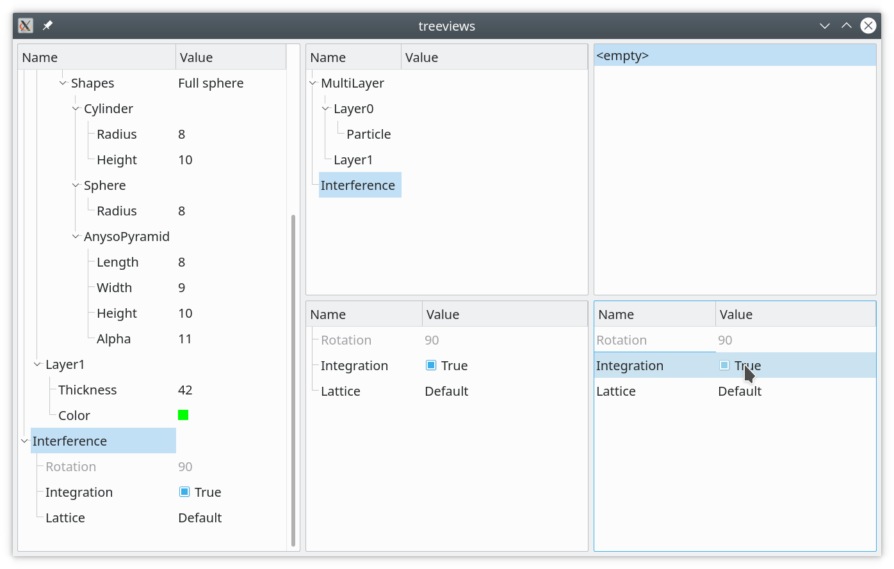

# Example "treeviews".

The example shows how to represent the model using trees with different layouts.

The application model contains a hierarchical structure, `MultiLayer`, which
holds `Layer` structures populated with particles. Every item has some editable
properties.

+ Tree on the left shows application model in the form of two-column tree with
  standard `property name` and `property value` layout. All items are shown.
+ Top tree at the center demonstrates a filtered tree, where only
  top-level-items are shown and all property items (leaves) are filtered out.
+ Bottom tree at the center shows currently selected branch corresponding to the
  `Particle`.
+ Top tree at the right shows undo-redo stack where the user can walk through
  modifications done to the data.
+ Bottom tree at the right shows properties (leaves) of currently selected
  `Particle` items.

The example also demonstrates the following features:

## Group property

This is a special object `Shapes` belonging to the `Particle`. It contains
predefined shapes the particle can have, together with currently selected shape.
Only property `Radius` of currently selected shape `Full sphere` is shown, other
children and children's properties are hidden in the property editor. 

## Business logic

Item `Lattice` demonstrates how to implement business logic. Every time the
user clicks on its `Integration flag` property, the property `Rotation` gets
either enabled or disabled.

Business logic is implemented via lambda's on board of `LatticeItem` (see
code for details).
